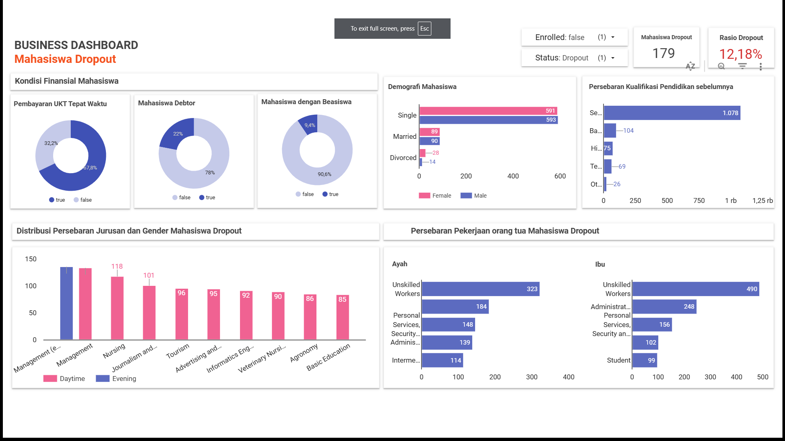

# **Submission Akhir: Menyelesaikan Permasalahan Institusi Pendidikan**

## **Business Understanding**
Jaya Jaya Institut (JJI) merupakan institusi pendidikan yang telah berdiri sejak tahun 2000 dan memiliki reputasi baik dalam mencetak lulusan berkualitas. Namun, tingginya angka siswa yang dropout menjadi masalah besar karena dapat memengaruhi reputasi, keberlanjutan operasional, dan kualitas lulusan institusi. Identifikasi dini terhadap siswa yang berpotensi dropout menjadi solusi utama untuk mencegah masalah ini. Intervensi berupa bimbingan khusus dapat diberikan lebih awal untuk membantu siswa tetap melanjutkan pendidikan mereka.

## **Permasalahan Bisnis**
Jaya Jaya Institut menghadapi tantangan serius terkait tingginya tingkat dropout mahasiswa, yang mencapai 32% dari total populasi. Berikut adalah poin-poin utama yang mencerminkan permasalahan bisnis berdasarkan insight yang diperoleh:

1. **Tingkat Dropout yang Signifikan di Berbagai Segmen Mahasiswa**

    Mahasiswa dengan status single, perempuan, dan mereka yang berasal dari latar belakang sosial-ekonomi rendah memiliki tingkat dropout yang tinggi. Mahasiswa laki-laki, meski jumlahnya lebih sedikit, juga menunjukkan tingkat ketidakberlanjutan studi yang lebih serius.

2. **Tingkat Dropout Berdasarkan Jadwal Studi**

    Mahasiswa kelas daytime mendominasi populasi, namun dropout di kelompok ini mencapai 50%. Mahasiswa kelas malam menghadapi tantangan unik yang mengakibatkan dropout lebih tinggi dari tingkat kelulusan.

3. **Faktor Sosial-Ekonomi yang Berpengaruh Besar**

    Mahasiswa dari keluarga dengan latar belakang pekerjaan buruh kasar atau tanpa keahlian memiliki risiko dropout yang lebih tinggi. Hal ini menunjukkan dampak signifikan dari keterbatasan dukungan finansial atau pendidikan orang tua.

4. **Kondisi Finansial Mahasiswa**

    Status debtor dan ketidakmampuan membayar biaya kuliah tepat waktu menjadi kontributor utama risiko dropout.

## **Cakupan Proyek**
1. Analisis Data Dropout
    
    Mengidentifikasi pola dan tren yang terkait dengan Dropout rate, seperti `Marital_status`, `Course`, `Previous_qualification`, `Nacionality`, `Mothers_occupation`, `Fathers_occupation`,
    `Daytime_evening_attendance`, `Gender`, `Debtor`, `Tuition_fees_up_to_date`, `Scholarship_holder`,
    `Curricular_units_1st_sem_enrolled`, `Curricular_units_1st_sem_approved`, `Curricular_units_1st_sem_grade`,
    `Curricular_units_2nd_sem_enrolled`, `Curricular_units_2nd_sem_approved`, `Curricular_units_2nd_sem_grade`,
    `Application_order`, `Status`

2. Identifikasi Faktor Penyebab Dropout
    
    Melakukan analisis statistik dan eksplorasi data untuk mengidentifikasi variabel utama yang memengaruhi keputusan Mahasiswa dropout. Selain itu, Menggunakan teknik machine learning Random Forest untuk menentukan faktor-faktor prediktif yang signifikan

3. Pembuatan Business Dashboard
    - Menyajikan data visualisasi menggunakan Looker untuk mencari faktor-faktor penyebab dropout.
    - Menampilkan prediksi mahasiswa yang berpotensi dropout.

3. Rekomendasi Strategi SDM

    Memberikan rekomendasi berdasarkan hasil analisis, seperti memberikan solusi finansial untuk mahasiswa berstatus debtor, serta memperbaiki program akademik dan fasilitas untuk mendukung kelompok dengan risiko tinggi.


## **Persiapan**
Sumber Data : [dataset](https://github.com/dicodingacademy/dicoding_dataset/blob/main/students_performance/data.csv)

**Setup Notebook** : 
   1. Jalankan perintah berikut untuk menginstal semua pustaka yang diperlukan dari file requirements.txt:
    
       `pip install -r requirements.txt`

   2. Instal Jupyter Notebook (opsional, jika belum terinstal): 
   
       `pip install jupyter`

   3. Jalankan Notebook:
   
       `jupyter notebook`

   4. Jalankan semua sel kode, mulai dari persiapan dataset hingga tuning hyperparameter.

   5. Persiapan Grid Search: Pastikan dataset Anda (data_label_df) sudah tersedia dan diolah sebelum menjalankan grid search. Data harus dipisah menjadi X_train, X_test, y_train, dan y_test.

   6. Evaluasi Model: Setelah menemukan model terbaik menggunakan GridSearchCV, evaluasi akurasi pada data uji seperti yang ditunjukkan pada kode Anda.

**Setup Aplikasi Streamlit (Local)** : 
   1.  Buka terminal atau command prompt.
   2.  Jalankan perintah berikut untuk membuat virtual environment:

       ```
       python -m venv env
       ```

   3.  Aktivasi Virtual Environment :
       - windows

        ```
        .\env\Scripts\activate
        ```

       - Linux/MacOs

        ```
        source env/bin/activate
        ```

   4. Pastikan file requirements.txt berada di direktori Anda.
   5. Jalankan perintah berikut untuk menginstal library yang diperlukan:
    
        ```
        pip install -r requirements.txt
        ```

   7. Jalankan aplikasi dengan perintah berikut:

        ```
        pip install streamlit
        ```

   8. Tunggu sebentar dan website streamlit akan muncul.   
 
## **Business Dashboard**
Link : [Dashboard](https://lookerstudio.google.com/reporting/79b5396e-4c16-4726-b42a-5d9baa09c1db)



1. **Kondisi Finansial sebagai Penyebab Utama Dropout**
 
    Mahasiswa dengan keterlambatan pembayaran UKT (32,2%) dan status sebagai debtor (22%) lebih berisiko mengalami dropout. Selain itu, hanya 9,4% mahasiswa penerima beasiswa.

2. **Kualifikasi Pendidikan Sebelumnya**
    
    Sebagian besar mahasiswa dropout berasal dari lulusan Secondary Education (1.078 mahasiswa), menunjukkan tantangan transisi dari sekolah menengah ke pendidikan tinggi.

3. **Jurusan dengan Tingkat Dropout Tertinggi**

    Jurusan Management (daytime dan evening) serta Nursing memiliki tingkat dropout tertinggi.

4. **Pekerjaan Orang Tua dan Latar Belakang Ekonomi**

    Mahasiswa dengan orang tua yang bekerja sebagai pekerja tidak terampil (ayah: 323, ibu: 490) memiliki tingkat dropout tertinggi

## Menjalankan Sistem Machine Learning
Link Aplikasi Prototype : [aplikasi-streamlit](https://rsmmenyelesaikanpermasalahaninstitusipendidikan.streamlit.app/)

#### Langkah Menjalankan Prototype
1. Klik atau salin link aplikasi website ke peramban (browser).
2. Terdapat tiga expander utama di aplikasi ini:
 
    - `Predict Student Condition (Graduate or Dropout)` : Menu ini menyediakan formulir untuk memprediksi apakah seorang mahasiswa berpotensi untuk lulus (graduate) atau dropout.
    - `Actual Student Condition` : Menu ini menampilkan 3 tabel yang berisi kondisi mahasiswa sesungguhnya, terbagi menjadi `active`, `Graduate` dan `Dropout`
    - `Predicted Student Condition` : menampilkan 2 tabel yang berisi hasil prediksi kondisi mahasiswa, terbagi menjadi `Graduate` dan `Dropout`

3. Klik pada Predict Student Condition (Graduate or Dropout) untuk membuka formulir prediksi.
4. Masukkan semua parameter yang tersedia di formulir sesuai dengan data mahasiswa yang ingin diprediksi. Pastikan setiap kolom diisi dengan benar agar hasil prediksi akurat.
5. Klik tombol `Submit` setelah semua parameter terisi.
6. Hasil prediksi akan muncul di bawah tombol Submit. Hasil akan menampilkan apakah mahasiswa tersebut berpotensi untuk `lulus (graduate)` atau `dropout`.

## Conclusion
  1. Kondisi finansial mahasiswa menunjukkan kurangnya dukungan finansial dapat menjadi hambatan utama. Perluasan program beasiswa dan fleksibilitas pembayaran bisa menjadi solusi efektif.
  2. Jumlah dropout dari basic education dan higher education juga signifikan. Perlu adanya program bimbingan akademik untuk membantu adaptasi mahasiswa.
  3. Faktor seperti tekanan akademik, beban waktu belajar, atau kurangnya dukungan bisa menjadi penyebab utama. Fokus intervensi pada jurusan ini akan membantu menekan dropout di program studi yang paling terdampak.
  4. Kondisi ekonomi keluarga berpengaruh signifikan terhadap keberlanjutan studi mahasiswa. Dukungan berupa bantuan finansial dan konseling dapat meningkatkan retensi mahasiswa dari latar belakang ekonomi rentan.
   
## **Rekomendasi Action Items**
   1. **Program Dukungan Finansial yang Lebih Luas**
    
      Perluasan program beasiswa dan pemberian skema pembayaran UKT yang fleksibel bagi mahasiswa dengan keterbatasan finansial. Kampus dapat bekerja sama dengan lembaga donatur atau pemerintah untuk menambah kuota beasiswa dan menyediakan opsi pembayaran cicilan. Membantu mahasiswa mengatasi hambatan finansial dan fokus menyelesaikan studi.
   
   2. **Pendekatan Khusus untuk Jurusan Rentan Dropout**
    
        Evaluasi metode pengajaran, beban studi, dan lingkungan belajar di jurusan dengan tingkat dropout tinggi seperti Management dan Nursing. Mengadakan survei untuk memahami kebutuhan mahasiswa dan menerapkan strategi seperti tutor tambahan, sesi belajar kolaboratif, dan dukungan waktu belajar yang fleksibel. Meningkatkan kualitas pembelajaran dan kepuasan mahasiswa, sehingga meminimalisir dropout di jurusan tersebut.
